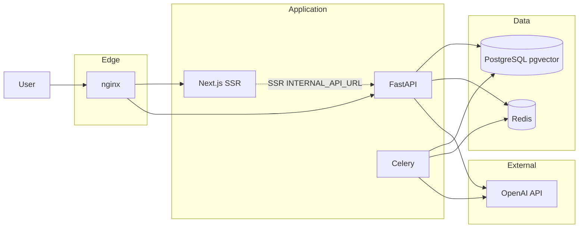
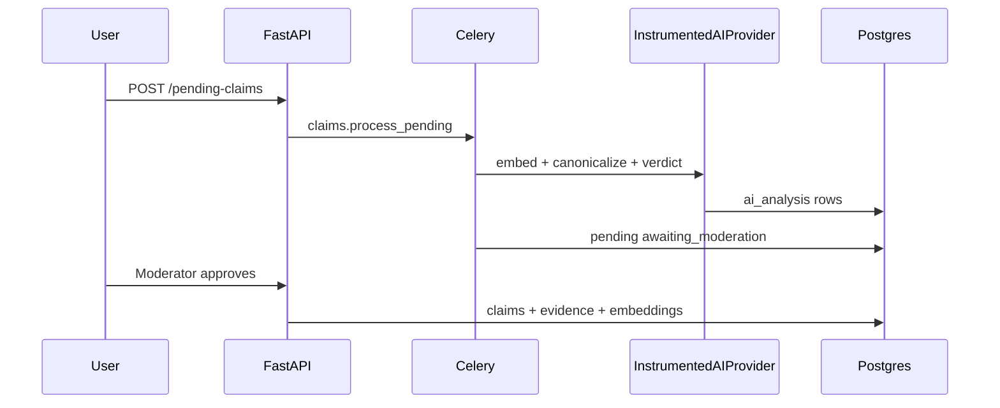

# Rate My Claim

Evidence-backed **semantic claim intelligence** platform: claim submission, async AI enrichment with retrieval-first prompts, pgvector hybrid search, structured verdicts with citations, moderation workflows, relationship graphs, and operational observability.

## Architecture overview



| Layer | Technology |
|-------|------------|
| Edge | nginx (path routing, TLS in production) |
| API | FastAPI, SQLAlchemy 2 async, Alembic |
| UI | Next.js 15 App Router, TypeScript, Tailwind |
| Workers | Celery + Redis broker |
| Database | PostgreSQL 16 + **pgvector** (HNSW), FTS `search_vector` |
| Cache / limits | Redis (AI cache, search cache, token budgets, Celery) |
| AI | OpenAI default (`text-embedding-3-small`, `gpt-4o-mini`); optional Ollama provider |

## AI architecture



- **Provider registry** — OpenAI or Ollama (`AI_PROVIDER`).
- **InstrumentedAIProvider** — Redis cache, retries, structured audit logs, Prometheus metrics (`rmc_ai_*`).
- **Token budgets** — daily and per-scope caps in Redis (`OPENAI_*` env vars).
- **Retrieval-first** — each claim’s **one enrichment run** searches the open web, fetches up to **three allowlisted reputable sources** (URL + excerpt + retrieval date saved on the claim), then runs the verdict. **Neighbor-claim evidence borrow is disabled.**
- **Isolation** — canonical claims in `claims`; AI output in `ai_analysis` (non-canonical on the UI).

## Prerequisites

- Docker and Docker Compose
- **OpenAI API key** (`OPENAI_API_KEY`)
- Copy **`.env.example`** → **`.env`** (never commit `.env`)

## Quick start (local development)

```bash
cp .env.example .env
# Edit .env: SECRET_KEY, OPENAI_API_KEY

docker compose up --build
```

Open **http://localhost:8080** (nginx).

| URL | Purpose |
|-----|---------|
| http://localhost:8080/ | Frontend |
| http://localhost:8080/api/v1/... | API |
| http://localhost:8080/health | Liveness |
| http://localhost:8080/ready | Readiness (DB + Redis) |
| http://localhost:8080/metrics | Prometheus metrics |

Optional observability profile:

```bash
docker compose --profile observability up -d
```

- Prometheus: http://localhost:9090  
- Grafana: http://localhost:3001 (dashboard: **Rate My Claim — Operations**)

### Seed data

```bash
docker compose exec -e SEED_DEVELOPMENT=true backend python scripts/seed_development.py
docker compose exec backend python scripts/seed_graph_demo.py   # contradiction graph edges
```

Default seed users (change passwords in production): `seed_admin`, `seed_moderator` — password from `SEED_PASSWORD` in `.env` (default `SeedDev!ChangeMe123`).

The first **registered** user becomes **admin** if no seed is used.

## Docker setup

### Development (default)

`docker-compose.yml` runs hot-reload on backend, `pnpm dev` on frontend, and bind-mounts source trees.

```bash
docker compose up -d
docker compose logs -f backend celery frontend
```

### Production-oriented stack

Use production overrides (no source mounts, Next.js standalone build, TLS nginx):

```bash
cp .env.production.example .env
# Configure secrets, domain, and place TLS certs in nginx/certs/

docker compose -f docker-compose.yml -f docker-compose.prod.yml up -d --build
docker compose exec backend alembic upgrade head
```

See [docs/deployment/digitalocean.md](docs/deployment/digitalocean.md) for a full host guide.

## Migrations

Migrations run automatically on backend container start (`alembic upgrade head`).

Manual:

```bash
docker compose exec backend alembic upgrade head
docker compose exec backend alembic current
```

Integration tests verify a single Alembic head and DB revision (`tests/test_phase11_migrations.py`).

## Enrichment and sources

Public submit is **text only** (no user URLs). Each pending claim runs **one** Celery enrichment pass:

1. Embed and canonicalize the claim text.
2. **Source discovery** — web search → filter to **allowlisted reputable domains** (`backend/config/reputable_sources.yaml`) → fetch up to **3** pages → save **URL, excerpt, publisher credibility, and retrieval date** on the claim as Evidence.
3. **Assessment** — reasoning model scores the claim using those excerpts (no neighbor-claim evidence borrow).
4. **Finalize** — publish truth status, summary, and `evidence_count` (**sources on record**).

Tune behavior in [`backend/config/enrichment_pipeline.yaml`](backend/config/enrichment_pipeline.yaml):

| Section | Purpose |
|---------|---------|
| `sources.*` | Max sources, excerpt length, credibility floor, allowlist path |
| `retrieval.borrow_from_similar_claims` | `false` by default (legacy neighbor borrow) |
| `truth.*` | When public truth stays inconclusive vs supported/refuted |
| `ai.*` | Combined assessment call, provisional verdict without corpus |

Restart **backend** and **celery** after YAML edits. Browse cards show **`N on record`** (saved Evidence rows). Claim pages list clickable sources with excerpt and retrieval date.

There are **no automatic re-runs**; moderators can reprocess a pending claim manually when needed.

## Environment variables

| Variable | Required | Description |
|----------|----------|-------------|
| `SECRET_KEY` | Yes | JWT signing (≥ 32 chars) |
| `OPENAI_API_KEY` | Yes | Embeddings and enrichment |
| `DATABASE_URL` | Yes | Async SQLAlchemy (`postgresql+asyncpg://…`) |
| `DATABASE_SYNC_URL` | Recommended | Sync URL for Alembic/Celery |
| `REDIS_URL` | Yes | Cache, budgets, readiness |
| `CELERY_BROKER_URL` / `CELERY_RESULT_BACKEND` | Yes | Task queue |
| `CORS_ORIGINS` | Yes | Comma-separated browser origins |
| `PUBLIC_APP_URL` | Yes | Canonical site URL for links |
| `COOKIE_SECURE` | Prod | `true` behind HTTPS |
| `INTERNAL_API_URL` | Docker | Frontend SSR → backend (`http://backend:8000`) |
| `OTEL_ENABLED` | No | OpenTelemetry traces to collector |

Full templates: [`.env.example`](.env.example), [`.env.production.example`](.env.production.example).

### OpenAI token budgets

| Variable | Default | Meaning |
|----------|---------|---------|
| `OPENAI_ENFORCE_TOKEN_BUDGETS` | `true` | Disable with `false` only in trusted dev |
| `OPENAI_MAX_TOKENS_PER_DAY` | `200000` | UTC daily `total_tokens` cap (`0` = off) |
| `OPENAI_MAX_TOKENS_PER_CLAIM_SCOPE` | `80000` | Per enrichment/search scope |

## Observability

- **Structured JSON logs** — correlation via `X-Request-ID`; AI calls include provider, cache, duration.
- **Prometheus** — `rmc_ai_*`, `rmc_search_cache_*`, `rmc_vector_query_*`, `rmc_moderation_*`, `rmc_celery_*`, plus HTTP metrics from FastAPI instrumentator.
- **OpenTelemetry** — set `OTEL_ENABLED=true` and run the `otel-collector` service (observability profile).
- **Grafana** — provisioned dashboard under `observability/grafana/`.

Details: [docs/operations.md](docs/operations.md).

## Scaling strategy

| Stage | Approach |
|-------|----------|
| Single host | Docker Compose + production override ([DigitalOcean guide](docs/deployment/digitalocean.md)) |
| Multi-instance API | Stateless FastAPI replicas, shared Postgres/Redis, load balancer |
| Workers | Scale Celery replicas on queue depth (`rmc_celery_queue_depth`) |
| Database | Managed Postgres with pgvector; read replicas for heavy search |
| Cloud native | [AWS scaling notes](docs/deployment/aws-scaling.md), [Kubernetes migration](docs/deployment/kubernetes.md) |

## Testing

### Backend

```bash
# Unit tests (no database)
docker compose exec backend python -m pytest tests/ -q

# Full suite including Postgres integration
docker compose exec -e RUN_PG_INTEGRATION=1 backend python -m pytest tests/ -q
```

Or on the host: `.\scripts\run_backend_tests.ps1`

### Frontend

```bash
cd frontend && pnpm install && pnpm test
# or
docker compose run --rm frontend sh -c "pnpm install && pnpm test"
```

CI runs on push via [`.github/workflows/ci.yml`](.github/workflows/ci.yml).

## API surface (summary)

| Area | Examples |
|------|----------|
| Claims | `GET /api/v1/claims`, `GET /api/v1/claims/{slug}`, submit pending |
| Search | `GET /api/v1/search/claims` (hybrid ranking, cursor pagination) |
| Graph / timeline | `GET /api/v1/claims/{slug}/graph`, `…/timeline` |
| Moderation | `GET /api/v1/moderation/pending-claims`, `POST /api/v1/moderation/actions` |
| Auth | Register, login, refresh, CSRF cookie for browser mutations |
| Ops | `/health`, `/ready`, `/metrics` |

## Frontend pages

| Route | Description |
|-------|-------------|
| `/` | Home and search entry |
| `/search` | Hybrid semantic search |
| `/claims` | Browse claims |
| `/claims/[slug]` | Evidence-first detail, graph, timeline, AI panel |
| `/submit` | Submit claim |
| `/moderation` | Moderator queue |
| `/users/[id]` | Public profile |

## Troubleshooting

| Issue | Fix |
|-------|-----|
| **502 after `restart backend`** | `docker compose exec nginx nginx -s reload` |
| **Migrations / pgvector** | Image `pgvector/pgvector:pg16`; run `alembic upgrade head` |
| **Celery not processing** | `docker compose ps celery`; check broker URLs |
| **401 on moderation** | Sign in on same origin; check cookies and `COOKIE_SECURE` |
| **`Module not found` frontend** | `docker compose exec frontend pnpm install` |
| **Graph empty** | `python scripts/seed_graph_demo.py` |
| **pytest not found** | Rebuild backend image (includes `[dev]` deps) |

More: [docs/operations.md](docs/operations.md).

## Deployment documentation

- [DigitalOcean](docs/deployment/digitalocean.md)
- [AWS scaling](docs/deployment/aws-scaling.md)
- [Kubernetes](docs/deployment/kubernetes.md)

## Repository layout

```text
backend/          FastAPI, Alembic, Celery, pytest
frontend/         Next.js App Router, Vitest
nginx/            Development and production nginx configs
observability/    Prometheus, Grafana, OTEL collector
docs/             Operations and deployment guides
docker-compose.yml
docker-compose.prod.yml
```

## License

See [LICENSE](LICENSE).
