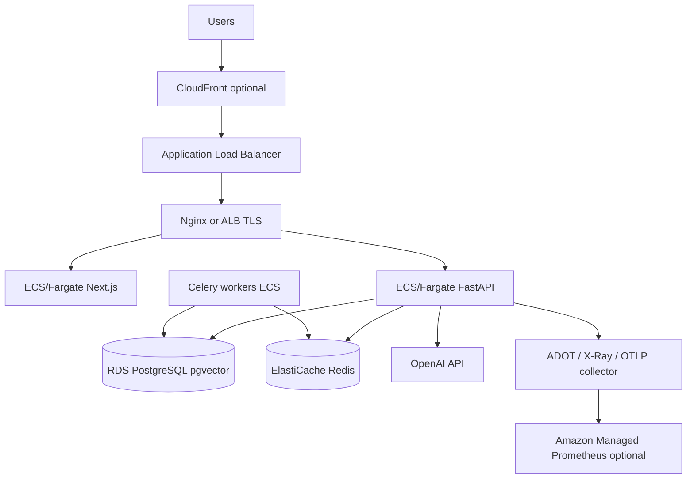

# AWS scaling architecture notes

Reference architecture for growing Rate My Claim beyond a single Docker host.

## Target architecture

## Service mapping

| Component | AWS service | Notes |
|-----------|-------------|-------|
| PostgreSQL + pgvector | **RDS PostgreSQL 16** | Enable `vector` extension via parameter group / migration |
| Redis | **ElastiCache Redis 7** | Separate logical DBs for cache, Celery broker, results |
| API | **ECS Fargate** or **EKS** | Run `uvicorn` with 2+ workers per task |
| Celery | **ECS Fargate** (separate service) | Autoscale on queue depth |
| Frontend | **ECS Fargate** or **Amplify** | Next.js standalone image |
| Edge TLS | **ALB + ACM** | Or CloudFront → ALB |
| Secrets | **Secrets Manager** | `SECRET_KEY`, `OPENAI_API_KEY`, DB password |
| Metrics | **AMP + Grafana** or self-hosted Prometheus | Scrape `/metrics` from private subnet |
| Traces | **ADOT** → **X-Ray** or OTLP | Set `OTEL_ENABLED=true` |

## Scaling dimensions

### API tier (stateless)

- Scale **ECS service desired count** on CPU and p95 latency.
- Keep **sticky sessions off**; auth uses JWT cookies validated per request.
- Set `DATABASE_URL` pool size per task to avoid exhausting RDS connections (`pool_size` + `max_overflow` tuning).

### Celery workers

- Scale on **Redis queue length** (`rmc_celery_queue_depth` Prometheus metric).
- One enrichment job is CPU + OpenAI bound; prefer **horizontal worker tasks** over very high concurrency per task.
- Use **dead-letter** pattern: failed pending rows stay `failed` with `error_message` for moderator review.

### PostgreSQL

- **Read replicas** for browse/search heavy traffic (route read-only search queries to replica via separate engine — application change).
- **Storage autoscaling** on RDS; monitor pgvector index size.
- Run `VACUUM` / autovacuum tuning for FTS + vector tables.

### Redis

- **Cluster mode** when Celery + AI cache + rate limits exceed single-node memory.
- Separate clusters for **broker** vs **application cache** in large deployments.

### OpenAI

- Centralize **token budgets** (`OPENAI_MAX_TOKENS_PER_DAY`) per environment.
- Use **request hedging** sparingly; enrichment is already async via Celery.

## Network security

- Place RDS and ElastiCache in **private subnets**.
- API tasks in private subnets; only ALB public.
- Security groups: ALB → API:8000, API → RDS:5432, API → Redis:6379, workers → same.

## CI/CD sketch

1. GitHub Actions builds and pushes images to **ECR**.
2. ECS rolling deploy for `backend`, `frontend`, `celery`.
3. Run `alembic upgrade head` as a **one-off ECS task** before service rollout.

## Cost controls

- Fargate Spot for Celery workers (tasks must tolerate interruption via `acks_late` — already configured).
- RDS Reserved Instances for steady state.
- CloudWatch alarms on `rmc_ai_cost_usd_total` derivative and OpenAI daily caps in Redis.
